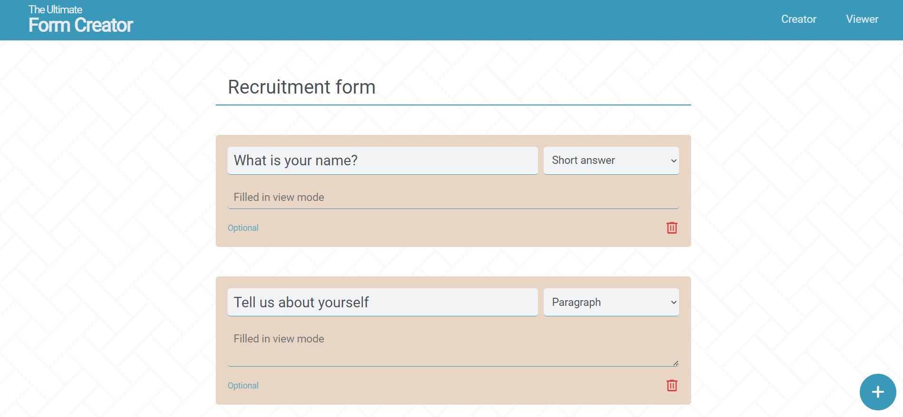
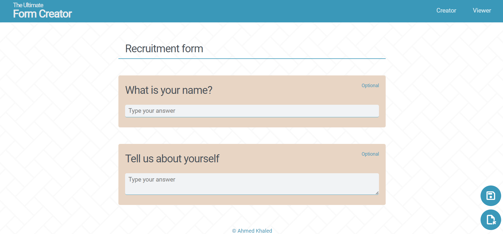
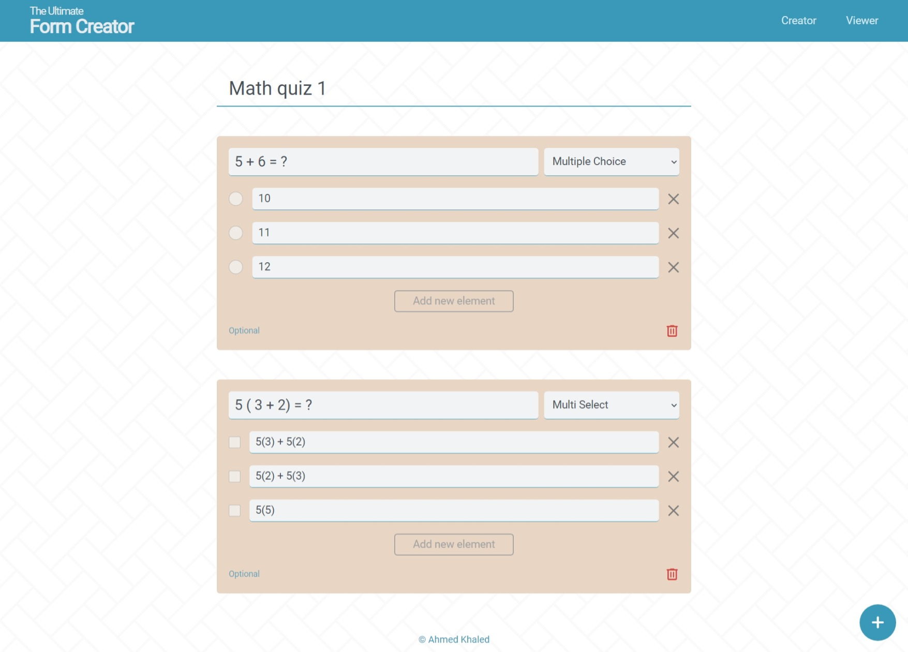
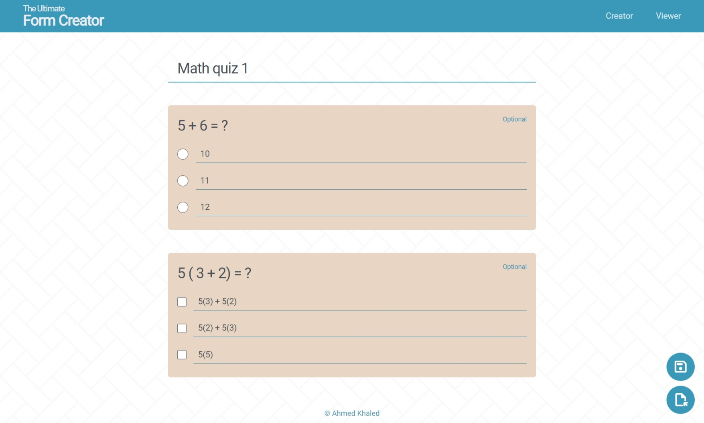

# The Ultimate Form Creator
## Front end react app that creates reusable forms

Front-end react app that allow users to build forms then export them as JSON or HTML file to used it in any place

### Explain the GUI
The app has two modes, navigate between them using the links in the navbar:   
   1. #### Edit or `Creator` mode
        
        In this mode user can add questions using the plus button in the right-most bottom     
   2. #### View mode
        
        In this mode user can see how their form looks like from submitter's perspective, also in this mode the user can export the form as HTML or JSON and also can open a pre-saved form using the buttons at the right-most bottom

### How to use 
1. Using Creator mode create all questions you need (for example creating quiz) 
2. Navigate to View mode to see your question from submitter perspective 
3. Save your form using the right-most bottom buttons      
 
4. Choosing HTML option, the app asks you about the target server link to send POST requests to (in this tutorial I am using express server running on http://localhost:8000/)

5. After save the html file open it to fill the form then press submit
    
The data reach the server is in this form    


### Components structure
 


### Try the app
You can try the hosted version from [HERE](https://ahmed-khaled24.github.io/Form-Creator/) or clone the repo and run it locally

### How install and run
**For this steps to work you need to have node and npm installed on your machine**
1. Clone the repo    
    ``` 
        git clone https://github.com/Ahmed-Khaled24/Form-Creator 
    ```
2. Install dependencies   
    ``` 
        npm install  
    ```
3. Run the app    
    ``` 
        npm start 
    ```

 
   

